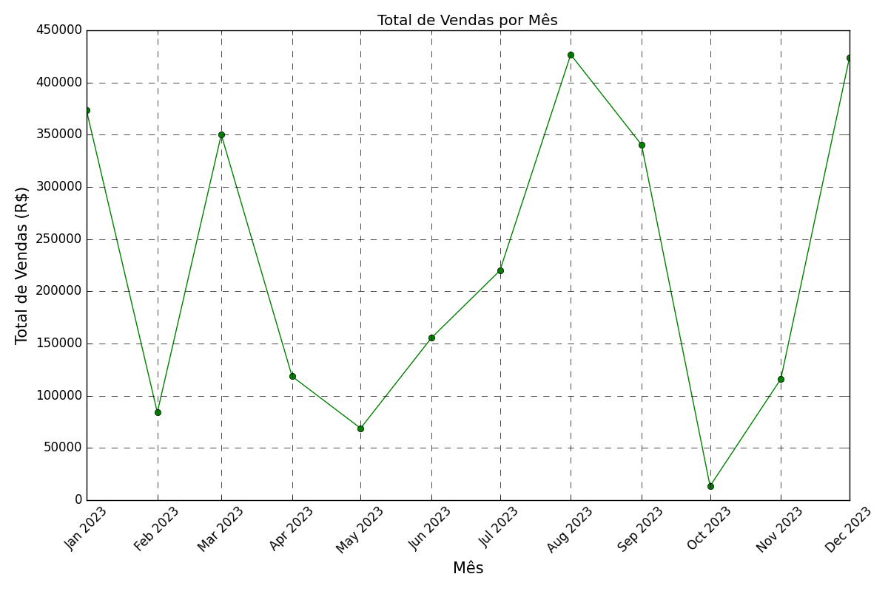
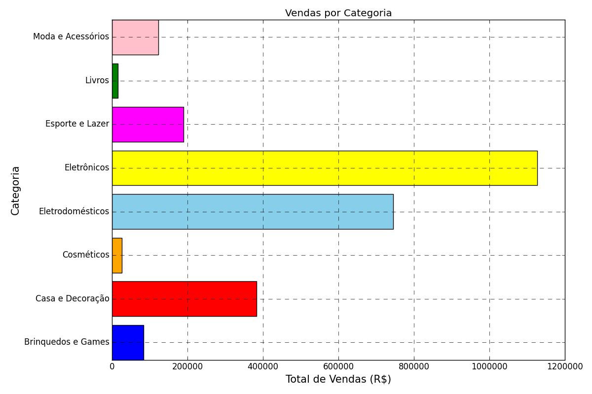

<a id="inicio-readme"></a>

<p align="center">
    
</p>

<h1 align="center">Projeto: Análise de Dados de Vendas</h1>

<!-- MENU DA DOCUMENTAÇÃO -->
<details>
  <summary><b>☰ Menu da Documentação</b></summary>
  <ol>
    <li>📊 Sobre o projeto</li>
    <li>🛠️ Tecnologias utilizadas</li>
    <li>🗃️ Estrutura do Repositório</li>
    <li>
      ⚙️ Configuração
      <ul>
        <li><a href="#1️⃣-clone-o-repositório">Clonando o repositório</a></li>
        <li><a href="#2️⃣-instale-as-dependências-do-projeto">Instalando as dependências</a></li>
      </ul>
    </li>
    <li>
      ▶️ Como funciona
      <ul>
        <li><a href="#ℹ️-observações-iniciais">Observações</a></li>
        <li><a href="#1️⃣-geração-e-limpeza-dos-dados">Geração e limpeza dos dados</a></li>
        <li><a href="#2️⃣-análise-exploratória">Análise exploratória</a></li>
        <li><a href="#3️⃣-consultas-sql">Consultas SQL</a></li>
        <li><a href="#4️⃣-relatório-de-insights">Relatório de insights</a></li>
      </ul>
    </li>
  </ol>
</details>

<!-- SOBRE O PROJETO -->
# 📊 Sobre o Projeto
* Este repositório contém um estudo fictício de geração, limpeza e análise de dados de vendas, com foco em simular cenários reais para prática de Data Analytics.
* O projeto permite tanto utilizar o dataset original (data_clean.csv) quanto gerar novos dados aleatórios no mesmo arquivo para diferentes análises.

# 🛠️ Tecnologias utilizadas
   * Python 3.10+
   * Pandas -> manipulação de dados
   * Matplotlib -> visualização e geração de gráficos
   * Faker -> geração de dados fictícios
   * SQL -> consultas e análises

# 🗃️ Estrutura do repositório
   ```bash
analise_vendas/
│
├── Parte 1/ # Geração dos dados e limpeza
│   │
│   ├── Gráficos/ # Visualizações geradas
│   │   │
│   │   ├── vendas_categoria.png
│   │   │
│   │   └── vendas_mes.png
│   │
│   ├── analise_exploratoria.py
│   │
│   ├── data_clean.csv
│   │          
│   ├── geracao_limpeza_dados.py
│   │
│   └── map_produto_cat_preco.py
│   
├── Parte 2/ # Consultas SQL
│   │
│   ├── consultas_sql.sql
│   │
│   └── teste_consulta.py
│
├── Parte 3/ # Relatório de Insights
│   │
│   └── relatorio_insights.md
│
├── img/ # Imagens auxiliares
│
├── .gitignore                   
│
├── README.md                   
│
└── requisitos.txt # Dependências do projeto
   ```

# ⚙️ Configuração
Siga as etapas de configuração abaixo para o funcionamento correto dos scripts.

## 1️⃣ Clone o repositório
   ```bash
   git clone https://github.com/brunomanganoti/analise_vendas.git

   cd analise_vendas
   ```
## 2️⃣ Instale as dependências do projeto
   ```bash
   pip install -r requisitos.txt
   ```

# ▶️ Como funciona
Etapas para geração das visualizações e novas análises.

## ℹ️ Observações iniciais
* As análises originais foram feitas a partir dos dados encontrados no arquivo 'data_clean.csv' original do repositório.
* Caso queira gerar novos dados e gráficos para diferentes análises, siga as etapas abaixo.
* Os novos dados serão gerados em arquivo de mesmo nome, <b>substituindo o antigo.</b> 
* Local do arquivo: <mark>../Parte 1/data_clean.csv</mark>

## 1️⃣ Geração e limpeza dos dados
Execute o script para criar um dataset fictício e aplicar limpeza básica de dados (remoção de duplicatas e tratamento de nulos):
```bash
cd "Parte 1" # se necessário
py geracao_limpeza_dados.py
```
Isso vai gerar o arquivo 📄 <mark>data_clean.csv</mark>.

### 💻 Saída no terminal
O script <mark>geracao_limpeza_dados.py</mark> também permite que você visualize os dados antes e após a limpeza pelo terminal.
<br><br>
Basta escolher o que deseja visualizar, <b>remover os comentários</b> dos trechos correspondentes e executar o script.

### Ⅰ. Visualizar: Dados gerados de forma bruta (raw data) | Linha <b>61</b>
```py
"""
print('\n-----------------------------')
print('DADOS GERADOS (FORMATO BRUTO)\n')
print(df_vendas.to_string(index=False))
"""
```

### Ⅱ. Visualizar: Dados após limpeza (duplicatas e nulos) | Linha <b>76</b>
```py
""" 
print('\n----------------------------------')
print('APÓS TRATAMENTO E LIMPEZA DE DADOS\n')
print(df_vendas.to_string(index=False)) 
"""
```

### Ⅲ. Visualizar: Dados após cálculo e adição de nova coluna 'total_vendas' | Linha <b>95</b>
```py
""" 
print('\n-------------------------------')
print('APÓS CÁLCULO DO TOTAL DE VENDAS\n')
print(df_vendas_clean.to_string(index=False)) 
"""
```

### 📝 Exemplo de saída:
```bash
-------------------------------
APÓS CÁLCULO DO TOTAL DE VENDAS

 ID       Data             Produto          Categoria  Quantidade  Preço  total_vendas
  1 2023-09-20     Suspense Demais             Livros         4.0   54.9         219.6
  2 2023-06-26            Chuteira    Esporte e Lazer        54.0  229.9       12414.6
  3 2023-04-05             Raquete    Esporte e Lazer        54.0  199.9       10794.6
  4 2023-03-14          Hidratante         Cosméticos        69.0   39.9        2753.1
  5 2023-11-25   A História de SQL             Livros        40.0   59.9        2396.0
```

## 2️⃣ Análise exploratória
Para executar a análise exploratória e gerar novos gráficos:
```bash
cd "Parte 1" # se necessário
py analise_exploratoria.py
```
Serão criados os arquivos (imagens dos gráficos no formato .png):
* 📊 <mark>vendas_categoria.png</mark> -> gráfico de vendas por categoria
* 📊 <mark>vendas_mes.png</mark> -> gráfico de vendas por mês

### 📈 Exemplos de gráficos gerados:
<div>
   
   
</div>

## 3️⃣ Consultas SQL
O arquivo ⛃ <mark>consultas_sql.sql</mark> na pasta "Parte 2" contém exemplos de consultas SQL para visualização dos dados.<br><br>
Caso queira, também é possível testar essas consultas pelo arquivo: 📜 <mark>teste_consulta.py</mark> a partir dos comandos abaixo:<br>
```bash
cd "Parte 2" # se necessário
py teste_consulta.py
```

### 📝 Exemplo de saída:
```bash
            Produto  total_vendas
0              Peão         804.6
1          Chuteira       12414.6
2  Relógio de Pulso       23422.9
3  Máquina de Secar      118794.6
```

## 4️⃣ Relatório de insights
O relatório de insights está localizado em: <mark>../Parte 3/relatorio_insights.md/</mark>, contendo observações e os principais insights referentes às visualizações geradas.

<p align="right">[<a href="#inicio-readme">voltar ao início</a>]</p>
